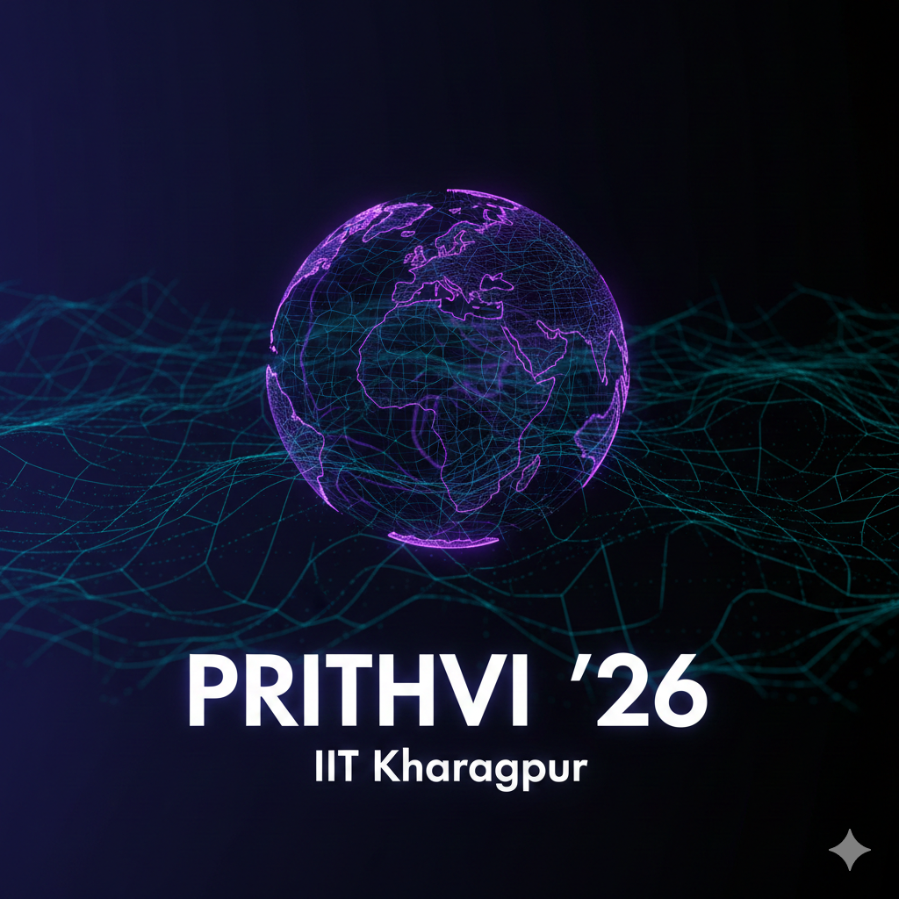

# 🌍 PRITHVI 2026 | The Geological Zenith

> **The 18th International Earth Science Symposium at IIT Kharagpur** > *Unearth the Future • April 3–5, 2026*



[](https://krish686.github.io/prithvi-26/)
[](https://krish686.github.io/prithvi-26/)
[](LICENSE)

## 📖 About the Project

**PRITHVI 2026** is the official web portal for the annual geological symposium organized by the Department of Geology & Geophysics at IIT Kharagpur. 

This project is not just an informational site; it is a fully interactive **Web App** featuring user authentication, event registration, payment processing workflows, and a dedicated administration dashboard. The design philosophy merges **geological aesthetics** with **futuristic sci-fi elements**, utilizing glassmorphism and 3D rendering.

---

## ✨ Key Features

### 🎨 Immersive UI/UX
* **3D Interactive Earth:** A rotating wireframe globe with particle atmosphere built using **Three.js**.
* **Dual Theme System:** * 🌑 *Seismic Night* (Dark Mode - Default)
    * ❄️ *Glacial Day* (Light Mode)
* **Glassmorphism Design:** Modern, frosted-glass UI elements with neon accents.
* **Animations:** Smooth scroll reveals via **GSAP** and parallax tilt effects via **Vanilla Tilt**.

### 🔐 User System (Firebase)
* **Authentication:** * Google Sign-In integration.
    * Email/Password registration with validation.
    * Forgot Password flows.
* **Profile Management:** * Users can edit personal details (Name, Institution, Year).
    * **Security Check:** "Re-authentication" modal required for sensitive changes (Password/Data updates).
    * **Digital ID Card:** Auto-generated unique ID for participants.

### 📝 Registration & Payments
* **Multi-Step Form:** Guided registration wizard.
* **Payment Integration:** QR Code display for UPI payments and Transaction ID (UTR) collection.
* **Database:** Real-time data storage in **Firestore**.

### 🛡️ Admin Portal
* **Secure Dashboard:** Dedicated `admin.html` page protected by hardcoded email verification.
* **Data Management:** View real-time registrations in a tabular format.
* **Actions:** Ability to delete registrations directly from the UI.

### 📨 Utilities
* **Newsletter:** Integrated with **EmailJS** for instant subscription handling.
* **Toast Notifications:** Custom non-blocking alerts (replacing default browser alerts).
* **Custom 404:** Themed error page with geological humor.

---

## 🛠️ Tech Stack

### Frontend Core
* **HTML5** (Semantic Markup)
* **CSS3** (Variables, Grid/Flexbox, Media Queries)
* **JavaScript** (ES6+, Async/Await)

### Libraries & Frameworks
* **[Three.js](https://threejs.org/):** 3D WebGL rendering.
* **[GSAP](https://greensock.com/gsap/):** ScrollTrigger animations.
* **[Vanilla-Tilt.js](https://micku7zu.github.io/vanilla-tilt.js/):** 3D hover effects.
* **[FontAwesome 6](https://fontawesome.com/):** Icons.

### Backend & Services (Serverless)
* **[Firebase Auth](https://firebase.google.com/docs/auth):** Identity management.
* **[Cloud Firestore](https://firebase.google.com/docs/firestore):** NoSQL Database.
* **[EmailJS](https://www.emailjs.com/):** Client-side email dispatch.

---

## 📂 Project Structure

```text
prithvi-26/
├── assets/                  # Static assets
│   ├── gallery/             # Event photos
│   ├── logos/               # Favicon, Og-image
│   └── sponsors/            # Sponsor logos
├── index.html               # Main landing page (User facing)
├── admin.html               # Admin Dashboard (Restricted)
├── style.css                # Global styles, themes, and responsive design
├── script.js                # Core logic (3D, Auth, UI interactions)
├── 404.html                 # Custom Error Page
├── robots.txt               # SEO directives
├── sitemap.xml              # SEO sitemap
└── README.md                # Documentation